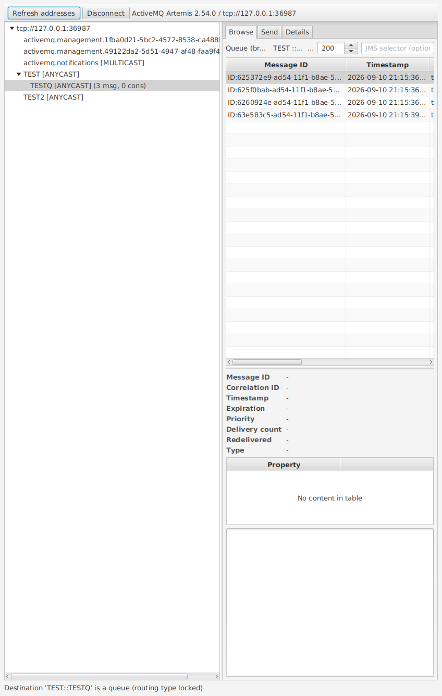

# Argus

A cross-platform desktop client for **ActiveMQ Artemis**. Connect with an authenticated
user over the **Core** or **OpenWire** protocol, list addresses and queues, browse
queue contents, inspect message headers/properties/bodies and send messages —
**without JMX**.

## Why Argus

Existing Artemis tooling is browser/JMX based (web console, hawtio). Argus uses the
broker's native protocols only, which means it:

- works against brokers where JMX is remote/locked down or disabled
- needs nothing but the same port your applications already use
- uses exactly the permissions (browse, send, manage) granted to your broker user

## Key features

- Saved connection profiles (Core or OpenWire, SSL support)
- Address tree with routing types, queues, message counts and consumer counts
- Queue browsing with message-count limits and optional JMS selectors
- Message inspector: headers, properties, body (JSON-friendly text, hex for binary)
- Send messages (text or bytes, custom properties) to queues or topics
- Graceful handling of permissions: inaccessible queues are reported, not hidden

## Quick start

1. Install via the argus-msi (Windows), argus-dmg (macOS) or argus-deb (Linux) artifact
   from CI builds, or run from source (`mvn javafx:run`, see `docs/development.md`).
2. Enter host/port, credentials and protocol (Core recommended), then Connect.
3. Expand an address in the tree, select a queue and press **Browse**.

## Documentation

| Topic | File |
|---|---|
| Installation (Windows/macOS/Linux) | [docs/installation.md](docs/installation.md) |
| Connecting: profiles, protocol choice, SSL | [docs/connecting.md](docs/connecting.md) |
| Browsing queues and message details | [docs/browsing.md](docs/browsing.md) |
| Sending messages | [docs/sending.md](docs/sending.md) |
| Broker permissions required | [docs/permissions.md](docs/permissions.md) |
| Troubleshooting | [docs/troubleshooting.md](docs/troubleshooting.md) |
| Building from source / contributing | [docs/development.md](docs/development.md) |

## Known limitations

- Listing of addresses requires the `manage` permission on the
  `activemq.management` address. Without it, use manual queue entry (see
  `docs/permissions.md`).
- In OpenWire mode, destination listing relies on Artemis destination advisories
  (`supportAdvisory=true` on the acceptor). Queue statistics are not available in
  OpenWire mode (no native, JMX-free primitive).

## Project layout

- `README.md` — this file (start here)
- `docs/` — user and developer documentation
- `AGENTS.md` — brief guide for AI coding agents working on this repository

## AI assistance

Argus is developed with the help of AI coding agents powered by AI models hosted at
[Berget AI](https://berget.ai).

## License

Licensed under the [Apache License, Version 2.0](LICENSE).
